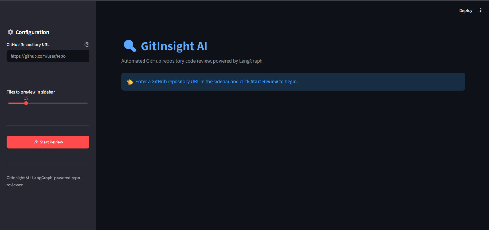
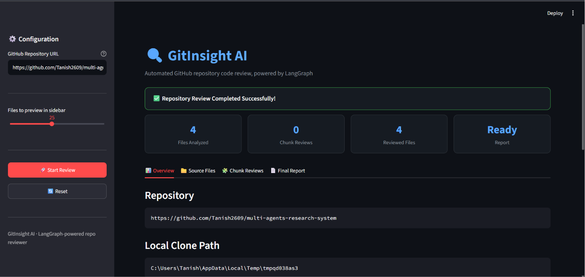
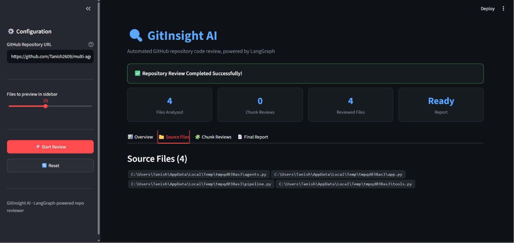
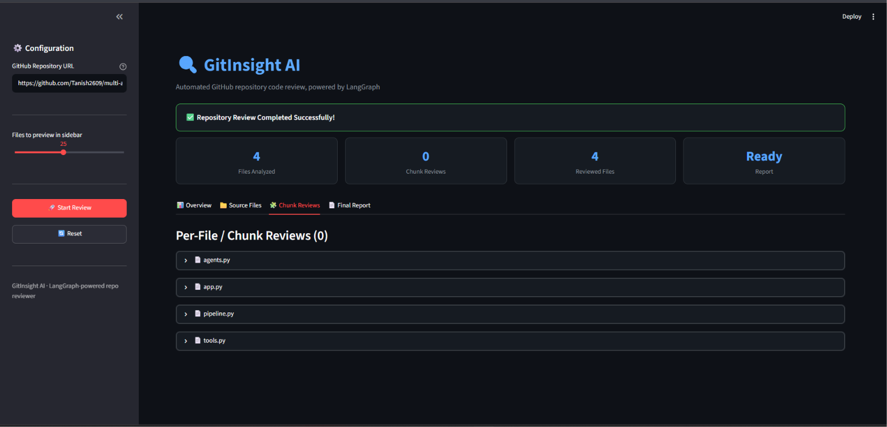
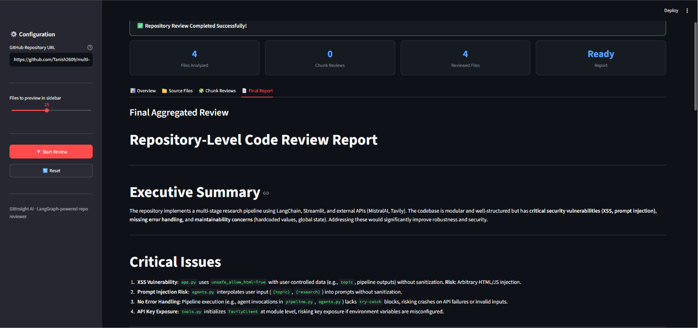

# 🔍 GitInsight AI

> An AI-powered GitHub repository code review system built with **LangGraph** that automatically clones GitHub repositories, reviews source code using LLMs, generates repository-level insights, and exports professional Markdown reports.

---

# 🚀 Overview

GitInsight AI automates repository code reviews through a **multi-agent workflow** powered by LangGraph and Mistral AI.

Instead of manually inspecting every source file, the application:

- Clones a GitHub repository
- Parses supported source files
- Reviews code using AI
- Summarizes file-level findings
- Generates repository-level insights
- Exports a professional Markdown report

---

# ✨ Features

- 📦 Clone any public GitHub repository
- 📂 Automatic source file parsing
- 🧩 Intelligent chunking for large files
- 🤖 AI-powered code reviews
- 📄 File-level summarization
- 🏗 Repository-level analysis
- 📝 Markdown report generation
- ⚡ Interactive Streamlit dashboard
- 🌙 Modern Dark UI
- 🔄 Multi-Agent workflow using LangGraph

---

# 🏛 Architecture

```
GitHub Repository
        │
        ▼
 Clone Repository
        │
        ▼
 Parse Repository
        │
        ▼
 Select Source File
        │
        ▼
 Code Reviewer
        │
        ▼
 File Summarizer
        │
        ▼
 Repository Summarizer
        │
        ▼
 Report Writer
        │
        ▼
 Markdown Report
```

---

# 🧠 Multi-Agent Workflow

GitInsight AI follows a sequential multi-agent architecture where each agent performs a single dedicated responsibility.

| Agent | Responsibility |
|--------|----------------|
| Clone Repository | Clone the GitHub repository |
| Parse Repository | Extract supported source files |
| File Selector | Select the next file for analysis |
| Code Reviewer | Review source code using Mistral AI |
| File Summarizer | Merge chunk-level reviews |
| Repository Summarizer | Generate repository-wide insights |
| Report Writer | Export the final Markdown report |

Each agent communicates through a shared **LangGraph State**, making the workflow modular and maintainable.

---

# 🛠 Tech Stack

### AI

- LangGraph
- LangChain
- Mistral Medium 3.5

### Backend

- Python
- GitPython

### Frontend

- Streamlit

---

# 📸 Screenshots

## Home



---

## Repository Overview



---

## Source Files



---

## Chunk Reviews



---

## Generated Repository Report

GitInsight AI automatically generates a comprehensive Markdown report containing repository insights.



📄 Sample Report: [multi-agents-research-system_review.md](reports/multi-agents-research-system_review.md)

---

# ⚙ Installation

Clone the repository

```bash
git clone https://github.com/Tanish2609/gitinsight-ai.git

cd gitinsight-ai
```

Install dependencies

```bash
uv sync
```

or

```bash
pip install -r requirements.txt
```

---

# 🔑 Environment Variables

Create a `.env` file.

```env
MISTRAL_API_KEY=your_api_key
```

---

# ▶ Running

```bash
streamlit run app.py
```

---

# 📋 Workflow

1. Enter a GitHub repository URL.
2. Clone the repository.
3. Parse supported source files.
4. Chunk large files automatically.
5. Review each file using AI.
6. Merge chunk reviews.
7. Generate repository insights.
8. Export the final Markdown report.

---

# 📄 Generated Report

The generated report includes:

- Executive Summary
- Critical Issues
- Code Quality Analysis
- Performance Insights
- Security Analysis
- Positive Highlights
- Actionable Recommendations

---

# 📂 Project Structure

```
gitinsight-ai/

├── graph/
├── models/
├── nodes/
├── prompts/
├── reports/
├── tools/
├── app.py
├── main.py
├── requirements.txt
└── README.md
```

---

# 🚀 Future Improvements

- Parallel repository reviews
- Multiple LLM provider support
- GitHub Pull Request reviews
- GitHub Actions integration
- Structured JSON output
- Repository comparison mode

---

# ⭐ Highlights

- Multi-Agent Architecture
- LangGraph StateGraph
- AI-powered Code Review
- Repository-level Analysis
- Intelligent File Chunking
- Automated Markdown Reports
- Interactive Streamlit Dashboard

---

# 👨‍💻 Author

**Tanish Sarmandal**

If you found this project useful, consider giving it a ⭐ on GitHub.